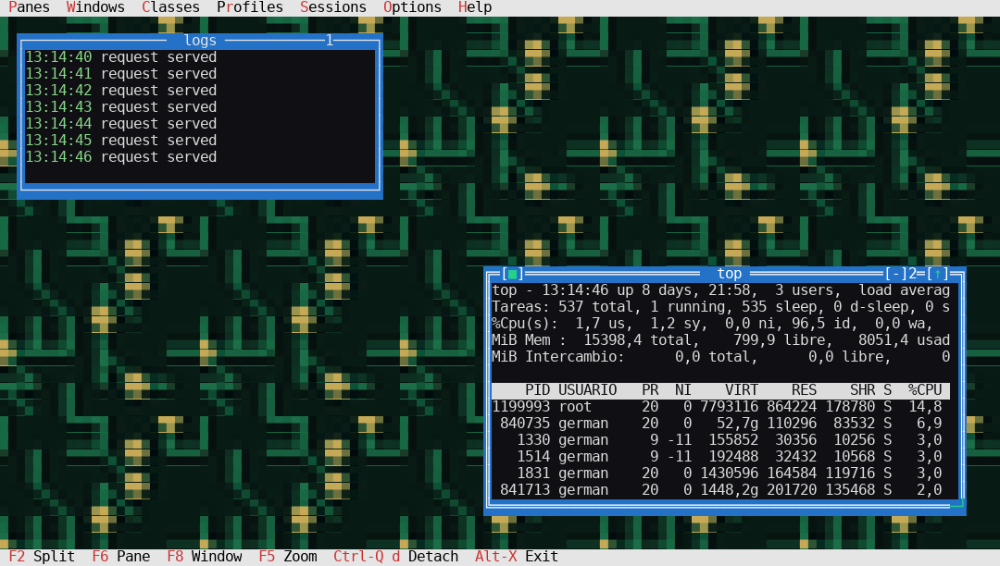

# superterm 3

**Project site: [www.superterm.org](https://www.superterm.org)**

`superterm` is a terminal multiplexer written in Free Pascal. It provides a
Turbo Vision-style window and pane interface inside one terminal, while every
visible pane remains a real PTY-backed terminal.

It is designed for working with several local shells and remote SSH sessions
at once. Sessions can be restored automatically, named profiles can describe
repeatable workspaces, and the session wizard can launch a small ad-hoc
workspace without editing a configuration file.

Since 3.0, **every session is a client/server pair from the moment it
starts**: the terminal you see is just the first attached client. That makes
superterm far more than a window manager for shells — the entire workspace
can be driven from any other shell, script, cron job or automation tool,
with commands and flags accepted **in English and in Spanish**:

```sh
superterm send prod:2 tail -f /var/log/syslog   # type into any pane
superterm capture prod:2 --history | grep ERROR # dump 100k lines of scrollback
superterm new prod --cmd htop -t Monitor        # open panes from outside
superterm focus prod:Monitor                    # move the focus
superterm organize prod grid                    # re-tile every window
superterm listar prod                           # the same CLI, en español
```

Meanwhile several people (or several of your own terminals) can be attached
to that same session at once, each seeing every keystroke, title change and
window operation live — and a slow or dead client can never stall the rest.
Full reference: [`docs/CLI.md`](docs/CLI.md).


The screenshot shows the English interface with four independent PTY-backed
panes in a normal GNU/Linux or macOS terminal window.

## Features

- Vertical and horizontal pane splits, focus navigation, mouse focus, resize,
  maximize, minimize, restore, and close operations.
- Up to 16 panes in one visible layout.
- Window classes (`[class.*]`): reusable named pane definitions for local
  commands and structured SSH connections with keys, agents, optional
  `sshpass` password support, and post-connect commands.
- Profiles (`[profile.*]`): named workspaces of windows and pane layouts
  whose panes reference window classes. Legacy `[t-*]` terminals and
  `[template.*]` templates (INI or SQLite) are still read and migrated.
- Every session is a server from launch (tmux-style): the visible terminal
  is just the first attached client, and the whole workspace can be driven
  from another shell with the control CLI. `[session] server=detach`
  restores the classic detach-only flow.
- A bilingual control CLI (commands and flags accepted in English AND
  Spanish, output in the configured UI language): `list/listar`,
  `send/enviar`, `capture/capturar` (visible screen, last N lines or the
  whole scrollback), `kill/matar`, plus full window management from the
  command line — `new/nueva`, `close/cerrar`, `focus/foco`,
  `rename/renombrar`, `resize/tamano`, `minimize/minimizar`,
  `restore/restaurar`, `zoom/ampliar` and `organize/organizar`. See
  [`docs/CLI.md`](docs/CLI.md).
- True multi-user sessions: up to 8 clients attached to the same session at
  once, with output broadcast, live window events, per-pane smallest-size
  negotiation, and slow-client flow control so one stalled client never
  blocks the rest.
- Named multi-session detach: several live sessions under
  `~/.superterm/sessions/`, tmux-style `Ctrl-Q d` detach, a session picker
  (`Ctrl-Q s`), and `superterm --attach` / `--list-sessions`. Local and
  remote PTYs stay alive on the session server.
- A configurable tmux-style prefix key (`[keymap]`, default `Ctrl-Q`).
- **ASCII art desktop backgrounds.** A picture behind the windows, in real RGB
  colour, chosen from `Options`. Pictures are plain text files read at run time
  -- eight ship, including the 7kas phoenix, the London skyline and three
  seamless patterns for the tiled layout -- so your own drops into
  `~/.superterm/backgrounds/` without rebuilding. Centred, tiled, stretched or
  fitted.
- Two per-profile display options in the Options menu: **show contents while
  dragging** (off gives a wireframe drag, where only the window outline moves
  and everything behind it stays visible -- much less traffic on a slow link)
  and an optional **zoom transition** for `F5`.
- Automatic session save and restore through `~/.superterm/session.ini`.
- A quick session wizard for one to four panes. Each pane accepts a connection
  command and an optional command to feed to the connection after it starts.
- A custom keyboard driver: a lone `Esc` reaches the pane (timeout-based, not
  treated as an Alt prefix), with CSI/SS3 decoding and X10/SGR mouse support.
- **Full-fidelity pane rendering.** Truecolor and 256-color escape sequences
  are carried through to the terminal exactly as the application sent them,
  together with the real UTF-8 glyphs, emoji at their true two-column width,
  combining marks, faint, and concealed text. A pane is no longer flattened to
  one CP437 byte and 16 colors per cell, whether it is tiled, windowed or
  maximized. The vendored FreeVision is not modified: its grid is still drawn
  and decides what is visible.
- **Maximize (`F5`) hands the pane the whole terminal** and writes its raw PTY
  bytes straight through, for applications that want the terminal to
  themselves. `F5` again restores the window at the size it had.
- English application interface by default, with a runtime-selectable Spanish
  interface.
- Local FreeVision sources in `vendor/fv322`, including wide-screen and tmux
  mouse fixes. The system FreeVision installation is not modified.

## Screenshots

**A picture on the desktop, behind the windows.** Eight ship and
your own drop into `~/.superterm/backgrounds/` without rebuilding. The colours
are real RGB, not the 16-colour grid.

| | |
| --- | --- |
|  |  |
|  |  |
|  |  |
|  |  |

The last three are seamless patterns meant for the tiled layout: they repeat
across the desktop with no visible join.

**A workspace, and `F5` giving one pane the whole terminal.**
Four windows share the desktop — a log tailer, a `watch` on disk usage, `top`
in the centre, and a fourth minimized to a title bar at the bottom. `F5`
maximizes the focused pane and hands it the entire terminal, so `top` reflows
into the full screen; `F5` again brings the desktop back with every window
where it was. The expanding outline is the optional zoom transition
(`[session] zoomanim`, off by default — the instant switch is the fast one):


**superterm in action — one capture per feature.**

Two clients attached to the same session at once: everything typed in client
A (left) appears live in client B (right), including the `print` injected
from a third shell with the control CLI:


A workspace built entirely from the command line — panes opened with
`nueva`, renamed with `renombrar`, re-tiled with `organizar rejilla`, the
Python expression typed with `send` — while the attached client watches it
happen:


Listing sessions and pane details (live command, size, scrollback lines,
focus flags) — note the English command with Spanish output, and the
Spanish `listar` alias:


Typing into a pane and capturing its screen or its whole scrollback from
another shell, pipe-clean:


The bilingual built-in help (`--help` / `--ayuda`):


Reusable window classes, named workspaces, and detachable sessions, all edited
in the app and stored in one INI file:

| Window classes | Profiles |
|---|---|
|  |  |

| Detachable sessions | Quick session wizard |
|---|---|
|  |  |

More captures are on the [Screenshots wiki page](https://github.com/garacil/superterm/wiki/Screenshots).

## Platform Support

`superterm` is a single cross-platform codebase that builds and runs natively on
**GNU/Linux and macOS** (Apple Silicon and Intel). Both are POSIX systems, so the
UI, VT engine, layout, configuration, and detach/attach server are shared without
change. The only platform-specific code is the PTY/process layer, selected at
compile time with `{$IFDEF DARWIN}`:

- **GNU/Linux** allocates the pseudo-terminal with the SysV `posix_openpt` sequence
  and reads process titles from `/proc`.
- **macOS** allocates it with BSD `openpty` + `login_tty` and reads process
  titles with `libproc`/`sysctl`. Free Pascal auto-defines `DARWIN`, so no build
  flag is required — run superterm in Terminal.app or iTerm2 exactly as on GNU/Linux.

See [`docs/MACOS.md`](docs/MACOS.md) for the macOS build, terminal setup, and
platform notes.

Windows is not a native target. WSL is the practical way to run superterm on
Windows; a native port would need a ConPTY backend plus Windows-specific process,
resize, signal, and configuration-path code.

## Technology Choice

`superterm` is intentionally written in Free Pascal. This is a project-specific
tradeoff, not a claim that Pascal is universally better than C:

- Free Pascal produces native binaries and provides access to POSIX, PTY, and
  SQLite APIs.
- FreeVision already supplies the terminal UI, event loop, and window controls
  needed by the application.
- Strong typing and ordinary Pascal memory management reduce implementation
  overhead for the layout, screen, session, and PTY code.
- The existing Pascal implementation works and its regression suite passes.

A complete C rewrite would have to recreate the UI, PTY handling, VT parser,
layout, session persistence, and tests without providing a concrete benefit for
the current requirements — including the persistent multi-client session server
and the bilingual control CLI, which are implemented in Pascal and covered by
the regression suite. For this cross-platform terminal multiplexer, continuing
in Pascal has a better benefit-to-risk ratio than rewriting it in C.

## Requirements

Build requirements:

- Free Pascal Compiler 3.2.2 or a compatible Free Pascal 3.x release.
- Free Pascal FV, FCL, and DB units.
- GNU make.
- A POSIX host: GNU/Linux (with `/proc`) or macOS (Apple Silicon or Intel).

Test requirements:

- Python 3.
- Python package `pyte`.

Remote requirements:

- `openssh-client` for SSH connections.
- `sshpass` only when password authentication is explicitly configured. SSH
  keys or an SSH agent are safer and preferred.

## Build

The project includes a self-contained POSIX `configure` script. It is not
generated by GNU Autoconf. It detects the compiler and test tools, then creates
the ignored `Makefile` from `Makefile.in`.

```sh
./configure
make release
```

The optimized release binary is `bin/superterm` and uses Free Pascal `-O4`.
The debug build is separate and uses symbols and line information:

```sh
make debug
```

The debug binary is `bin/superterm-debug` and uses `-O1 -g -gl -dDEBUG`.

Useful configure options:

```sh
./configure --prefix="$HOME/.local" \
  --sysconfdir="$HOME/.config/superterm"
./configure --with-fpc=/usr/local/bin/fpc
./configure --with-python=/usr/bin/python3
```

On Debian or Ubuntu, dependencies can be installed explicitly:

```sh
./configure --install-deps
```

On macOS, install Free Pascal with Homebrew (`brew install fpc`); `libsqlite3`
ships with the system and the build commands above are identical. `make
install-deps` detects macOS and uses Homebrew automatically.

The compatibility wrapper remains available:

```sh
./compile.sh
./compile.sh -B
```

Use `make info` to inspect the selected compiler, target, prefix, and paths.
See [`docs/BUILDING.md`](docs/BUILDING.md) for the source tree, vendor units,
build modes, installation, debugging, and platform boundaries.

## Tests

The tests launch isolated PTYs and do not attach to or restart a user's tmux
server.

```sh
make test
```

The suite covers pane operations, large terminal sizes, xterm and tmux mouse
input, focus routing, session restore, configured terminals, templates,
SQLite templates, the session wizard, language switching, and window controls.

Individual tests are also runnable directly:

```sh
python3 test/drive_test.py
python3 test/large_screen_test.py
python3 test/mouse_test.py
SUPERTERM_TEST_TERM=tmux-256color python3 test/mouse_test.py
python3 test/mouse_focus_test.py
python3 test/restore_test.py
python3 test/sysconfig_test.py
python3 test/template_test.py
python3 test/sqlite_test.py
python3 test/wizard_test.py
python3 test/language_test.py
python3 test/window_test.py
python3 test/detach_test.py
```

## Run

```sh
./bin/superterm
```

Since 3.0 the session is named when it starts (`--session NAME`, else the
active profile, else `session`) and `Ctrl-Q d` detaches instantly, with no
dialog. To return to a live session:

```sh
./bin/superterm --attach            # one session: direct; several: picker
./bin/superterm --attach dev        # attach by name
./bin/superterm list                # sessions table (also --list-sessions)
```

Plain `superterm` also offers the session picker at startup when live
sessions exist. Every launch starts a per-user session server at
`~/.superterm/sessions/<name>.sock` with a `<name>.ini` metadata sidecar
(the pre-existing single `~/.superterm/session.sock` from older builds is
still recognized). The server owns the PTY masters, process groups,
terminal parsers, and scrollback, so leaving the client — or losing it —
does not close local shells or remote SSH connections. `Alt-X` and `Alt-Q`
remain permanent exits that close the whole session: `Alt-X` asks the
server to save `session.ini` first, `Alt-Q` skips saving. Inside the app,
`Ctrl-Q s` opens the session picker to attach to or permanently close
other sessions.

Optional diagnostics:

```sh
SUPERTERM_DEBUG=/tmp/superterm-debug.log ./bin/superterm
```

Do not put passwords in command lines or debug logs.

## Controls

`Ctrl-Q` is the default prefix key; `[keymap] prefix` can change it. After
the prefix, an unbound key sends the prefix byte plus that key to the pane.

| Key | Action |
| --- | --- |
| `F2` / `F3` | Open a window; it appears centred and nothing already open is moved or resized |
| `Alt-F3` / `Alt-F4` | Close the focused pane; exit when one remains |
| `F6` / `F7` | Next / previous pane |
| `Alt-1..9` | Go to pane N |
| `Alt-0` | Pane list: pick a pane, restoring it if minimized |
| `F5` | Maximize or restore the focused pane |
| `Ctrl-F5` | Move or resize the focused pane |
| `Alt-F9` | Minimize the focused pane |
| `F8` / `F9` | Next / previous profile window |
| `Ctrl-Q 1..9` | Go to profile window N |
| `Ctrl-Q n` / `Ctrl-Q p` | Next / previous profile window |
| `Ctrl-Q` arrows | Resize the focused pane |
| `Ctrl-Q c` | Open a window class in a new pane |
| `Ctrl-Q s` | Session picker: attach to or close detached sessions |
| `Ctrl-Q t` | Tile the windows (opening one no longer re-tiles) |
| `Ctrl-Q d` | Detach the live session; reattach with `superterm --attach` |
| `superterm` inside a pane | Works: a new session, or any session this pane does not live inside of. Attaching to the pane's own session (or one above it) is refused -- it would mirror forever. The picker never offers those |
| `Ctrl-Q Ctrl-Q` | Send one literal `Ctrl-Q` to the pane |
| Mouse wheel | Scroll the pane's history (three lines a notch); on the alternate screen -- `less`, `vim` -- it sends arrow keys instead |
| Mouse, inside a pane | An application that asks for the mouse (`htop`, `mc`, `vim` with `mouse=a`, another superterm) gets it: clicks, drags, the wheel, in the protocol it asked for, at pane coordinates. The frame, title bar, menu and status line always stay superterm's |
| `Alt-PgUp` / `Alt-PgDn` | History: a page back / forward (`Ctrl-PgUp`/`Ctrl-PgDn` and `Shift-PgUp`/`Shift-PgDn` do the same where the host terminal lets them through) |
| `Alt-Home` / `Alt-End` | History: oldest line / back to live |
| `Ctrl-S` | Save now: profile selection or session layout; when attached, sync the layout to the session server |
| `Alt-X` | Exit and save when autosave is enabled |
| `Alt-Q` | Exit without saving |

The same actions are available from the `Panes`, `Windows`, `Classes`,
`Profiles`, `Sessions`, `Options`, and `Help` menus. The `Panes` menu also
offers classic `Tile`, `Cascade`, and `Refresh display` operations. `Options`
holds the language (`English`/`Espanol`, applied immediately), the color
palette (color, black and white, monochrome), and the autosave/autorestore
toggles. In Spanish mode the menus are `Paneles`, `Ventanas`, `Clases`,
`Perfiles`, `Sesiones`, `Opciones`, and `Ayuda`.

## Session Wizard

Open `Sessions -> Quick session wizard`. In Spanish mode use
`Sesion -> Asistente nueva sesion`.

The wizard asks for one to four panes. For each pane enter:

1. A connection command, such as `ssh -tt alice@prod.example.com`,
   `mosh alice@host`, `tmux attach -t remote`, or a local command.
2. An optional command to feed to the connection after it starts, such as
   `tmux new-session -A -s production`.

The wizard collects all entries before replacing the current runtime, so
canceling leaves the current panes unchanged. It does not modify INI or SQLite
templates and does not store credentials. Commands run under the configured
login shell and are intentionally not parsed or validated.

For persistent remote consoles, SSH keys and a command such as this are
recommended:

```text
Connection command: ssh -tt alice@prod.example.com
After connecting:   tmux new-session -A -s alice-prod
```

The post-connect input is sent as the connection starts. Password prompts may
consume the same input, so key-based authentication is recommended.

## Configuration

There are two configuration roles:

- `~/.superterm/superterm.ini` stores user preferences (language, prefix key,
  autosave, default profile) and the user's own window classes and profiles.
- `$SUPERTERM_INI`, or `/etc/superterm/superterm.ini` when unset, can provide
  shared window classes and profiles.

They may be the same file for a personal installation:

```sh
export SUPERTERM_INI="$HOME/.superterm/superterm.ini"
```

Classes and profiles from both files are merged by name; the user file wins.
The application creates `~/.superterm` with mode `700` automatically and
writes its own files with mode `600`.

### User settings

```ini
[autologin]
shell=/bin/bash
login=1

[keymap]
prefix=ctrl-q               ; ctrl-a..ctrl-z, a letter, or 1..26

[ui]
language=en                 ; en (default) or es
palette=color               ; color (default), bw, or mono

[session]
autosave=1
autorestore=1               ; use 0 for a fresh profile startup
default_profile=daily
```

The language value accepts `en`, `english`, `es`, `spanish`, or `espanol`.
The legacy `default_template`, `default_session`, and `default_window` keys
are still honored to select the startup profile and window. Configuration
keys and values such as `ini`, `sqlite`, `L`, `V`, and `H` are stable format
identifiers and must not be translated.

### Window classes

A window class (`[class.NAME]`) is a reusable pane definition. Its type is
derived from the fields: `connect` makes a free command class, `host` makes a
structured SSH class, and neither makes a local class. Legacy `[t-*]`
sections are still read and are migrated to `[class.*]` on save.

```ini
[class.production]
name=production
enabled=1
host=prod.example.com
user=alice
port=22
key=~/.ssh/id_ed25519
postconnect=tmux new -A -s main
scrollback=20000

[class.monitor]
name=monitor
enabled=1
cmd=htop
```

For SSH classes, `postconnect` is passed as the remote command, making
`tmux new -A` natural; `password` (base64) is supported through `sshpass`
but keys or an agent are preferred. For command and local classes,
`postconnect` is fed through the connection's standard input.

### Profiles

A profile (`[profile.NAME]`) is a named workspace: windows with pane layouts
whose panes reference window classes. Legacy `[template.*]` sections (INI or
SQLite `[storage]`) are still read and flattened into profiles.

```ini
[profile.daily]
name=daily
enabled=1
focused_window=0
windows=servers,logs

[profile.daily.window.servers]
enabled=1
layout=V:500;L;L            ; L = one pane; V side by side; H stacked
focused_pane=0
panes=prod,mon

[profile.daily.window.servers.pane.prod]
enabled=1
class=production

[profile.daily.window.servers.pane.mon]
enabled=1
class=monitor
```

Pane fields (`cmd`, `cwd`, `connect`, `postconnect`, `scrollback`) override
the referenced class. Layout ratios range from `0` to `1000`. Switch profile
windows with `Ctrl-Q 1..9`, `Ctrl-Q n`/`p`, or `F8`/`F9`.

See [`docs/CONFIGURATION.md`](docs/CONFIGURATION.md) for the complete
grammar, the SSH command structure, postconnect semantics, detached session
storage, and legacy compatibility (`[t-*]`, `[template.*]`, SQLite storage,
old `prefix=2`), and [`docs/WIZARD.md`](docs/WIZARD.md) for the wizard
behavior.

### Fallback session

When no profile takes priority, `~/.superterm/session.ini` stores the current
split tree and pane `cmd`, `cwd`, and class identity. With `autorestore=1`
(the default), the file is restored at startup. Set `autorestore=0` when a
default profile must create fresh daily connections.

## Source Layout

```text
src/
├── superterm.lpr   Program entry point and CLI (--attach, --list-sessions).
├── st_fvui.pas     FreeVision application, menus, panes, focus, and polling.
├── st_dialogs.pas  Class/profile managers, session picker, pane list.
├── st_layout.pas   Binary V/H split tree and pane rectangles.
├── st_pty.pas      POSIX PTYs, fork/exec, I/O, resize, and process cleanup.
├── st_screen.pas   VT100/ANSI parser and virtual screen for each pane.
├── st_server.pas   Detached session daemon, protocol and enumeration.
├── st_session.pas  Session serialization and restore.
├── st_wclass.pas   Window classes ([class.*], legacy [t-*] reader).
├── st_profiles.pas Profiles ([profile.*], legacy template flattening).
├── st_config.pas   User settings, prefix key, palette, and paths.
├── st_templates.pas Legacy INI and SQLite template loading.
├── st_kbd.pas      Custom keyboard driver (ESC timeout, CSI/SS3, mouse).
├── st_video.pas    Wide video output, CP437 glyph mapping, cursor restore.
├── st_keys.pas     FreeVision key codes to terminal escape sequences.
└── st_debug.pas    Optional runtime logging.
```

`vendor/fv322` is compiled locally before system FreeVision units. It contains
the `Objects`, `Drivers`, `Views`, `Menus`, `App`, `Dialogs`, and `MsgBox`
units plus the project-specific wide-screen and tmux mouse fixes.

## Installation

Prebuilt x86_64 packages for every release are on the
[releases page](https://github.com/garacil/superterm/releases/latest): a
portable tarball for any GNU/Linux, plus `.deb`, `.rpm` and Arch
`.pkg.tar.zst`. The only dependency is glibc, and each file ships with its
`.sha256`. macOS and ARM builds are published separately.

To build from source instead, for a system install:

```sh
./configure --prefix=/usr/local --sysconfdir=/etc
make release
sudo make install
```

The install contains the executable, README, all files under `docs/`, and an
example configuration. An existing configuration is never overwritten.

For a user-local install:

```sh
./configure --prefix="$HOME/.local" \
  --sysconfdir="$HOME/.config/superterm"
make install
```

Ensure `$HOME/.local/bin` is in `PATH`.

## Current Limits and Roadmap

Current limitations:

- Native runtimes are GNU/Linux and macOS; Windows is not yet a native target.
- The visible layout supports 16 panes; the wizard intentionally limits a
  quick launch to four panes.
- FreeVision rendering uses its classic palette and approximates truecolor.
- Activating a profile recreates local PTYs; only detached sessions keep
  processes alive across a switch.
- SSH post-connect commands are passed through SSH as remote commands; the
  wizard feeds its optional command through the connection input stream.

Planned platform and runtime work includes a native Windows ConPTY backend,
better connection readiness/retry state, and continued macOS parity polish.

## License and Author

Project site: <https://www.superterm.org> · Documentation:
[the wiki](https://github.com/garacil/superterm/wiki) · Releases:
[GitHub](https://github.com/garacil/superterm/releases)

Author: Germán Luis Aracil Boned — August 2026.

superterm is free software, released under the GNU General Public License
version 3 (see the `LICENSE` file). The bundled FreeVision fork in
`vendor/fv322` keeps its own licensing notices.
