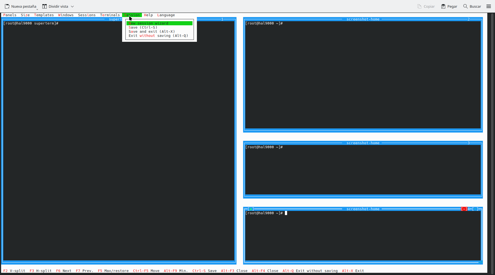

# Session Wizard

The built-in wizard is available from:

```text
Session -> New session wizard
```

In Spanish mode the same entry is `Sesion -> Asistente nueva sesion`.



It creates a fresh runtime session with one to four windows. For each window,
enter:

1. A connection command, for example `ssh -tt alice@prod.example.com`,
   `tmux attach -t remote`, `mosh alice@host`, or a local command.
2. An optional command to send after the connection command starts, for
    example `tmux attach -t someone` or `cd /srv/app && ./run.sh`.


The wizard tiles the resulting windows and focuses the first one. It does not
overwrite the INI or SQLite template files. Use the regular template
configuration when the session must be reproducible and named across restarts.

The connection command runs as a shell script under the configured login shell.
When a post-connect command is present, the wizard feeds it to the connection's
standard input as the command starts. This is suitable for interactive SSH,
tmux, telnet-like commands, and similar PTY programs. Key-based SSH login is
recommended; commands that require a password may consume the same input and
need to be tested carefully.

For a persistent remote console, enter:

```text
Connection command: ssh -tt alice@prod.example.com
After connecting:   tmux new-session -A -s alice-prod
```

For a command that should end in a shell, enter a command that starts one:

```text
After connecting: cd /srv/app && ./daily-command; exec bash -l
```

The wizard is intentionally a quick-launch tool. It does not attempt to parse
or validate arbitrary shell syntax and does not store credentials.
